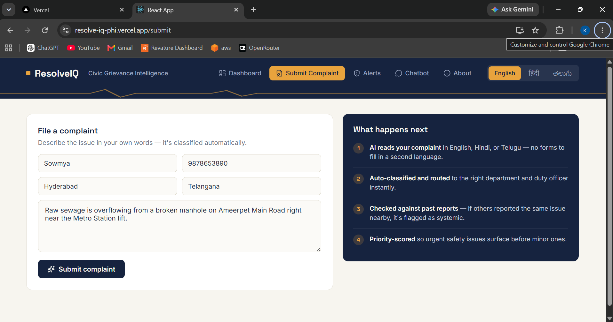
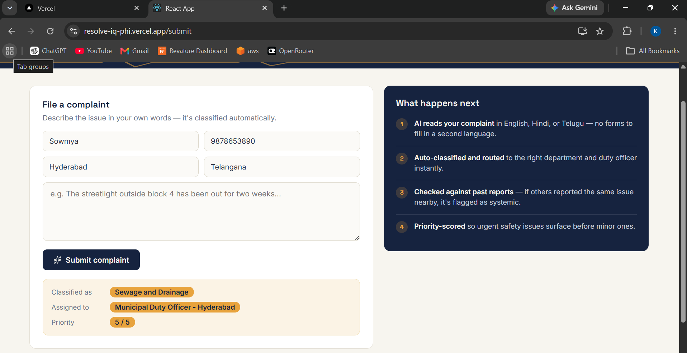
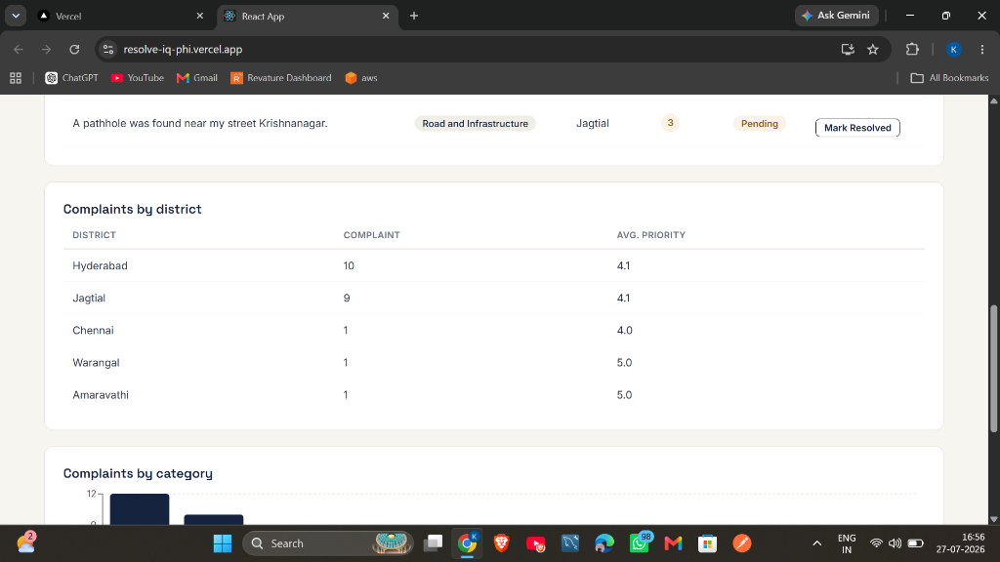
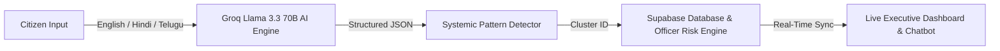
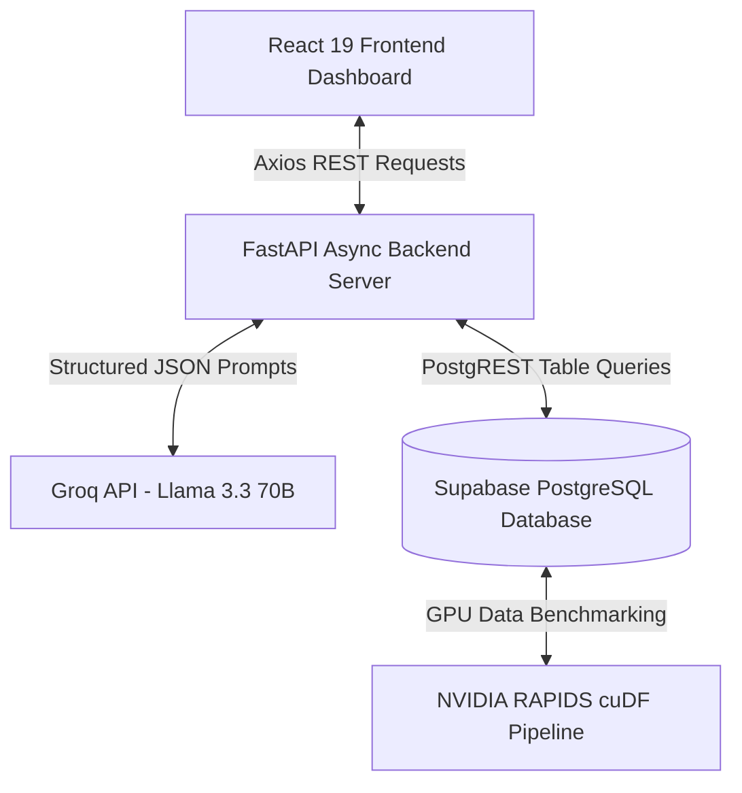

# ResolveIQ — Intelligent Multilingual Civic Grievance & Officer Accountability Engine

<div align="center">


  <h3><i>Transforming raw citizen complaints into automated pattern detection, real-time fraud alerts, and officer accountability at scale.</i></h3>

  <p align="center">
    <a href="#-short-project-overview">Overview</a> •
    <a href="#-live-demo-input--output-workflow">Live Input/Output Demo</a> •
    <a href="#-problem-statement">Problem Statement</a> •
    <a href="#-solution">Solution</a> •
    <a href="#-key-features">Key Features</a> •
    <a href="#-tech-stack">Tech Stack</a> •
    <a href="#-system-architecture">Architecture</a> •
    <a href="#-api-endpoints">API Docs</a>
  </p>

  <!-- Badges Section -->
  <p align="center">
    
    
    
    
    
    
    
  </p>

</div>

---

## 📋 Table of Contents

- [Short Project Overview](#-short-project-overview)
- [Live Demo: Input & Output Workflow](#-live-demo-input--output-workflow)
- [Problem Statement](#-problem-statement)
- [Solution](#-solution)
- [Key Features](#-key-features)
- [Tech Stack](#-tech-stack)
- [Simple Project Workflow](#-simple-project-workflow)
- [Simple System Architecture](#-simple-system-architecture)
- [API Endpoints](#-api-endpoints)
- [AI / ML Workflow](#-ai--ml-workflow)
- [Performance Highlights](#-performance-highlights)
- [Future Enhancements](#-future-enhancements)
- [Challenges Faced](#-challenges-faced)
- [Lessons Learned](#-lessons-learned)
- [Acknowledgements](#-acknowledgements)
- [Contact Information](#-contact-information)

---

## 🌐 Short Project Overview

**ResolveIQ** is an end-to-end, AI-driven civic grievance resolution platform designed to modernize public administration and officer accountability. Traditional complaint systems operate as static storage repositories where complaints sit unread in manual queues. ResolveIQ transforms raw citizen feedback into actionable intelligence in real time.

By combining **Groq Cloud API (Llama 3.3 70B)**, **Supabase PostgreSQL**, and **NVIDIA RAPIDS cuDF GPU acceleration**, ResolveIQ automatically parses native-language citizen reports (English, Hindi, Telugu), clusters recurring municipal infrastructure failures, calculates continuous officer corruption risk scores, and powers an interactive, data-grounded conversational chatbot.


*Figure 1: About ResolveIQ Portal — AI classification overview, multilingual features, smart hotspot detection, and conversational assistant.*

---

## 📸 Live Demo: Input & Output Workflow

ResolveIQ provides a frictionless experience for citizens and municipal administrators. A citizen simply describes an issue in plain, natural language without navigating complex municipal taxonomies, and the AI instantly processes, categorizes, routes, and scores the priority of the grievance.

### 📥 1. Input: Natural Language Complaint Submission
Citizens input their contact info and describe their grievance in natural language (English, Hindi, or Telugu). No predefined technical category selection is required.


*Figure 2 (Input): User entering complaint description: "Raw sewage is overflowing from a broken manhole on Ameerpet Main Road right near the Metro Station lift."*

---

### 📤 2. Output: Instant AI Extraction & Dynamic Routing Result
Upon submission, the underlying **Llama 3.3 70B AI Engine via Groq** instantly analyzes the text, assigns the appropriate infrastructure department, routes the complaint to the local duty officer, and computes a priority score based on public safety risk.


*Figure 3 (Output): Instant AI Classification Result displaying Category: Sewage and Drainage, Assigned Officer: Municipal Duty Officer - Hyderabad, and Priority Score: 5 / 5.*

| Output Field | AI Extracted Value | Impact / Automated Action |
| :--- | :--- | :--- |
| 🏷️ **Classified As** | `Sewage and Drainage` | Categorized instantly without manual staff intervention |
| 👤 **Assigned To** | `Municipal Duty Officer - Hyderabad` | Auto-routed to the specific local authority responsible |
| 🚨 **Priority Rating** | `5 / 5 (Urgent)` | Escalated to top queue for high public health/safety hazard |

---

## 🚨 Problem Statement

Every day, citizens report municipal infrastructure issues—burst water pipes, dangerous potholes, broken streetlights—or official misconduct to public grievance portals. Current systems suffer from critical limitations:

- **Unstructured & Slow Manual Triage:** Complaints require manual reading by office staff, delaying emergency responses by days or weeks.
- **Ignored Pattern Detection:** Multiple citizens reporting the exact same burst water pipe generate duplicate isolated tickets without linking to a shared root cause.
- **Opacity in Officer Corruption:** Complaints citing official misconduct remain isolated. No automated engine aggregates officer mentions to detect repeating corruption patterns.
- **Language Barriers:** Citizens comfortable only in regional languages (such as Hindi or Telugu) face accessibility hurdles on English-centric portals.
- **Lack of Transparency for Citizens:** Citizens submit complaints without visibility into resolution progress or district-wide status metrics.

---

## 💡 Solution

ResolveIQ converts passive complaint intake into an active, intelligent governance pipeline:

- **Instant Multilingual Parsing:** Reads raw complaints written natively in English, Hindi, or Telugu and extracts structured metadata in seconds using Llama 3.3 70B.
- **Automatic Systemic Clustering:** Groups co-located grievances in the same category under a shared `cluster_id` and flags `is_systemic: true`.
- **Officer Accountability Engine:** Tracks mentions of officials across complaint texts to compute real-time corruption risk scores and trigger automated fraud alerts in Supabase.
- **Data-Grounded AI Chatbot:** Enables citizens and administrators to ask natural-language questions answered live directly from current database records.
- **Proven High Scalability:** Leverages NVIDIA RAPIDS cuDF GPU acceleration to deliver a **9.6× speedup** over CPU pandas at 5 million complaint logs.

---

## ✨ Key Features

### 📊 1. Live Executive Analytics Dashboard & Hotspot Detection
A unified administrative dashboard displaying total complaints, pending tickets, resolved counts, flagged alerts, and active smart hotspots powered by live Supabase queries.


*Figure 4: Executive Dashboard displaying live complaint metrics (52 Total, 48 Pending, 4 Resolved, 4 Flagged) and automated smart hotspots (Ameerpet, Kondapur, Krishnanagar).*

---

### 📍 2. District Breakdown & Urgency Analytics
Computes aggregate complaint volumes and average urgency scores across regional districts, allowing administrators to allocate municipal resources where bottlenecks are highest.


*Figure 5: District Grievance Aggregation displaying complaint totals and average priority urgency across Hyderabad, Jagtial, Warangal, and Amaravathi.*

---

### 🛡️ 3. Corruption Risk & Officer Watchlist Engine
Tracks complaints citing specific officials over time, computing real-time risk scores and assigning performance grades (**Good**, **Average**, **Poor**) to flag repeating misconduct.


*Figure 6: Corruption Risk Officer Watchlist displaying officer risk scores, department assignments, and automated performance grades.*

---

### 🤖 4. Live-Grounded Conversational AI Chatbot
An interactive RAG chatbot powered by Groq Llama 3.3 70B allowing citizens and officials to query live database telemetry in plain, natural language.


*Figure 7: Data-Grounded Conversational AI Chatbot answering a query about high-risk officers (Officer Ramesh Reddy, Officer Govardhan) directly from live complaint telemetry.*

---

## 🛠️ Tech Stack

| Layer | Technology | Version / Spec | Badge | Role / Rationale |
| :--- | :--- | :--- | :--- | :--- |
| **Frontend UI** | React | `v19.2.8` |  | Component-based, fast single-page client architecture |
| **Client Routing** | React Router DOM | `v7.18.1` |  | Modern multi-page routing and navigation |
| **HTTP Client** | Axios | `v1.18.1` |  | Asynchronous API client for backend communication |
| **Multilingual (i18n)** | i18next / react-i18next | `v23.16.8 / v13.5.0` |  | Native language detection & switching (English, Hindi, Telugu) |
| **Data Viz** | Recharts | `v3.10.0` |  | Dynamic analytical charts & metric visualizations |
| **Icons** | Lucide React | `v1.27.0` |  | Clean vector icon system |
| **Backend API** | FastAPI | Python `3.11+` |  | High-performance async REST backend server |
| **AI / LLM Engine** | Groq Cloud API | `llama-3.3-70b-versatile` |  | Ultra-fast zero-shot JSON extraction & grounded chatbot |
| **Database** | Supabase | PostgreSQL / PostgREST |  | Real-time database storing grievances, officers, & fraud alerts |
| **GPU Analytics** | NVIDIA RAPIDS cuDF | `cudf-cu12` (CUDA 12) |  | GPU dataframe processing pipeline (9.6x speedup) |
| **Environment** | python-dotenv | Python package |  | Secure API key & database URI management |
| **Containerization** | Docker | `python:3.11-slim` |  | Lightweight container deployment with Uvicorn |

---

## 🔄 Simple Project Workflow



1. **Intake:** Citizen submits a complaint in English, Hindi, or Telugu.
2. **AI Extraction:** Groq Llama-3.3-70B extracts category, location, department, priority, sentiment, and named officers into strict JSON.
3. **Pattern Detection:** Supabase checks for co-located matching complaints and assigns a `cluster_id`.
4. **Accountability Check:** If an officer is cited, the system updates their risk score and triggers a fraud alert if needed.
5. **Real-Time Visibility:** The issue appears on the live dashboard and becomes instantly queryable via the chatbot.

---

## 🏗️ Simple System Architecture



- **React 19 Client:** Responsive user interface with i18next multilingual support, Recharts analytics, and interactive status controls.
- **FastAPI Backend Server:** Orchestrates asynchronous API routes, handles Groq AI calls, and manages database logic.
- **Groq Cloud API (Llama 3.3 70B):** Powers zero-shot multi-language extraction, categorization, priority scoring, and grounded RAG chatbot queries.
- **Supabase Database:** Central real-time relational database storing `grievances`, `officers`, and `fraud_alerts`.
- **NVIDIA RAPIDS cuDF Engine:** Accelerates multi-million row analytics and hotspot detection with GPU parallelism.

---

## 🔌 API Endpoints

| Endpoint | Method | Purpose | Response |
| :--- | :--- | :--- | :--- |
| `/submit-grievance` | `POST` | Submits raw complaint text; executes Groq AI extraction & systemic check | Returns extracted category, priority, department, and assigned officer |
| `/get-grievances` | `GET` | Retrieves all complaints from Supabase sorted by creation timestamp | Returns a list of grievance objects with current status flags |
| `/category-stats` | `GET` | Aggregates total complaint counts grouped by category | Returns category breakdown key-value pairs for dashboard charts |
| `/smart-hotspots` | `GET` | Identifies location + category clusters with 2+ active grievances | Returns hotspot locations, complaint counts, and cluster IDs |
| `/api/dashboard/districts` | `GET` | Computes complaint counts and priority scores grouped by district | Returns district-level analytics and average urgency metrics |
| `/api/alerts/corruption` | `GET` | Fetches officer risk scores, grades, and active fraud alerts | Returns list of flagged officer risk metrics and fraud alert cards |
| `/api/alerts/systemic` | `GET` | Lists grievance clusters flagged with `is_systemic: true` | Returns active systemic issue clusters and affected locations |
| `/chatbot` | `POST` | Processes natural language user questions using live data | Returns AI-generated answer grounded in current Supabase state |
| `/update-status` | `POST` | Updates grievance status (e.g. `Resolved`) and stamps timestamp | Returns updated grievance record confirmation |

---

## 🤖 AI / ML Workflow

ResolveIQ utilizes **Groq Cloud API with Llama 3.3 70B** for zero-shot structured text extraction across English, Hindi, and Telugu.

```
┌─────────────────────────────────────────────────────────────────────────┐
│                        RAW CITIZEN COMPLAINT INPUT                      │
│                                                                         │
│  "Raw sewage is overflowing from a broken manhole on Ameerpet Main     │
│   Road right near the Metro Station lift."                              │
└────────────────────────────────────┬────────────────────────────────────┘
                                     │
                                     ▼
┌─────────────────────────────────────────────────────────────────────────┐
│                     GROQ LLAMA 3.3 70B JSON PROMPT                      │
│                                                                         │
│  Extract: category, location, priority_score (1-5), sentiment_score,   │
│  department, mentioned_officer, predicted_resolution_days.              │
└────────────────────────────────────┬────────────────────────────────────┘
                                     │
                                     ▼
┌─────────────────────────────────────────────────────────────────────────┐
│                      STRUCTURED JSON OUTPUT (INLINE)                    │
│                                                                         │
│  {                                                                      │
│    "category": "Sewage and Drainage",                                   │
│    "location": "Ameerpet Main Road",                                    │
│    "priority_score": 5,                                                 │
│    "sentiment_score": 4,                                                │
│    "department": "Municipal Corporation",                               │
│    "mentioned_officer": "None",                                         │
│    "predicted_resolution_days": 2                                       │
│  }                                                                      │
└─────────────────────────────────────────────────────────────────────────┘
```

---

## ⚡ Performance Highlights

To demonstrate readiness for large-scale municipal or state deployments, ResolveIQ incorporates an **NVIDIA RAPIDS cuDF** GPU data pipeline benchmarked against CPU pandas.

### Measured GPU Benchmark Results

| Dataset Size (Rows) | Operation | CPU Pandas Execution | GPU RAPIDS cuDF Execution | Speedup Factor |
| :--- | :--- | :--- | :--- | :--- |
| **100,000** | Group-by + Aggregation | `0.0113 sec` | `0.0039 sec` | **2.9× Faster** |
| **5,000,000** | Multi-Filter + Group + Sort | `0.8177 sec` | `0.0854 sec` | 🚀 **9.6× Faster** |


*Figure 8: NVIDIA RAPIDS GPU setup and benchmark initialization in Google Colab.*


*Figure 9: Empirical benchmark execution proving a 9.6× speedup over Pandas at 5,000,000 complaint records.*

---

## 🔮 Future Enhancements

- [ ] **Interactive GIS Mapping:** Integrate Leaflet / Mapbox heatmaps for spatial grievance density analysis.
- [ ] **Voice Note Intake:** Support direct audio complaint filing via WhatsApp and mobile web interfaces.
- [ ] **Multi-Modal Damage Verification:** Use Vision LLMs to automatically analyze uploaded photos of potholes or broken pipes.
- [ ] **Predictive Maintenance:** Implement predictive ML models to detect potential infrastructure failures before citizens report them.

---

## 🥊 Challenges Faced

- **Multilingual Consistency:** Parsing non-English text occasionally returned conversational responses instead of raw JSON. Fixed by enforcing strict JSON mode (`response_format={"type": "json_object"}`) in Groq API.
- **Real-Time Query Optimization:** Aggregating data on raw SQL tables incurred latency on frequent dashboard refreshes. Resolved by indexing and optimized query execution in Supabase.
- **GPU Memory Management:** Processing multi-million row datasets on GPU required memory allocation management to prevent Out-Of-Memory (OOM) errors during RAPIDS benchmark execution.

---

## 💡 Lessons Learned

- **Data-Driven Governance:** Treating citizen complaints as structured telemetry provides actionable municipal insights far superior to traditional ticket queues.
- **Zero-Shot LLM Versatility:** Modern 70B open-weights LLMs handle multi-language metadata extraction in a single step without requiring separate translation pipelines.
- **GPU Acceleration at Scale:** NVIDIA RAPIDS cuDF significantly reduces data processing overhead for large analytical workloads.

---

## 🙏 Acknowledgements

- **Groq Cloud** for fast Llama 3.3 70B inference capabilities.
- **Supabase** for database hosting and real-time backend infrastructure.
- **FastAPI** for the async Python backend framework.
- **React & Recharts** for frontend web components and data visualizations.
- **NVIDIA RAPIDS** for open-source GPU data science libraries.
- **Lucide React** for UI icons.

---

## ✉️ Contact Information

**Keerthana Boga** — Lead Developer / Open Source Contributor  

- **Email:** [keerthanaboga4@gmail.com](mailto:keerthanaboga4@gmail.com)
- **GitHub Repository:** [https://github.com/keerthanaboga4/ResolveIQ](https://github.com/keerthanaboga4/ResolveIQ)

<div align="center">
  <br />
  <p><i>Made with ❤️ for transparent, intelligent, and accessible civic governance.</i></p>
</div>
