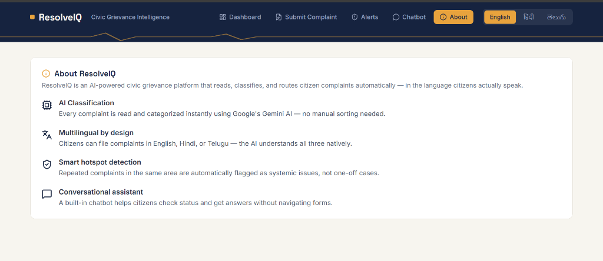
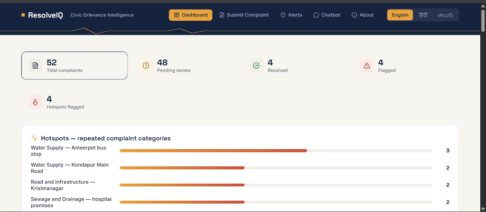
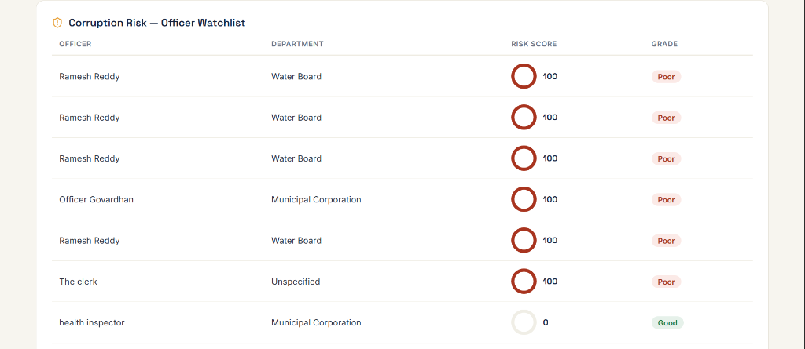
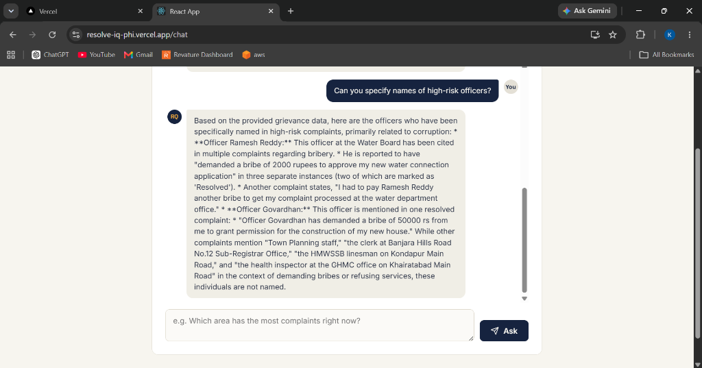
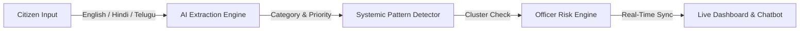
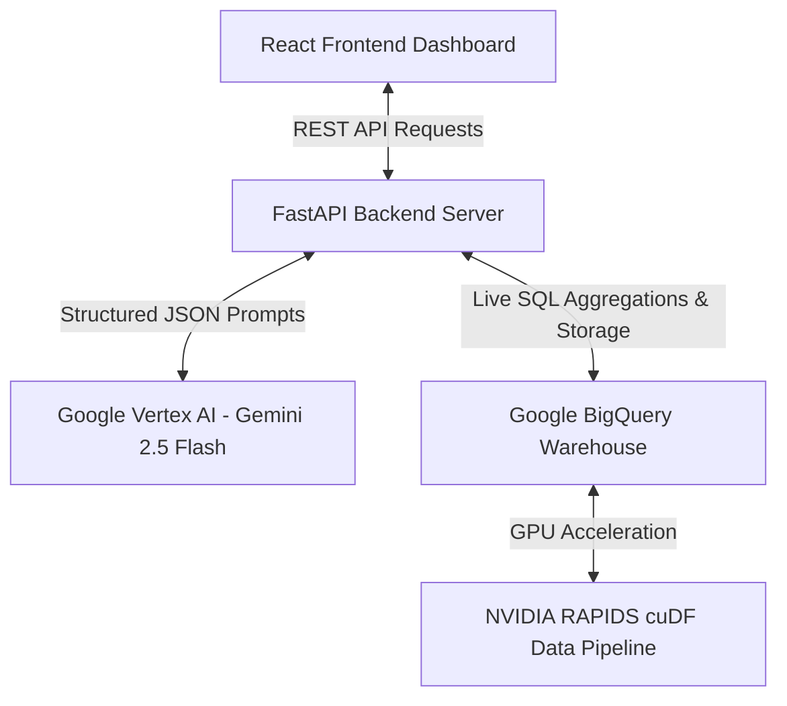

# ResolveIQ — Intelligent Multilingual Civic Grievance & Officer Accountability Engine

<div align="center">


  <h3><i>Transforming raw citizen complaints into automated pattern detection, real-time fraud alerts, and officer accountability at scale.</i></h3>

  <p align="center">
    <a href="#-short-project-overview">Overview</a> •
    <a href="#-problem-statement">Problem Statement</a> •
    <a href="#-solution">Solution</a> •
    <a href="#-key-features">Key Features</a> •
    <a href="#-tech-stack">Tech Stack</a> •
    <a href="#-project-workflow">Workflow</a> •
    <a href="#-system-architecture">Architecture</a> •
    <a href="#-api-endpoints">API Docs</a>
  </p>

  <!-- Badges Section -->
  <p align="center">
    
    
    
    
    
    
    
  </p>

</div>

---

## 📋 Table of Contents

- [Short Project Overview](#-short-project-overview)
- [Problem Statement](#-problem-statement)
- [Solution](#-solution)
- [Key Features](#-key-features)
- [Tech Stack](#-tech-stack)
- [Simple Project Workflow](#-simple-project-workflow)
- [Simple System Architecture](#-simple-system-architecture)
- [API Endpoints](#-api-endpoints)
- [AI / ML Workflow](#-ai--ml-workflow)
- [Performance Highlights](#-performance-highlights)
- [Future Enhancements](#-future-enhancements)
- [Challenges Faced](#-challenges-faced)
- [Lessons Learned](#-lessons-learned)
- [Acknowledgements](#-acknowledgements)
- [Contact Information](#-contact-information)

---

## 🌐 Short Project Overview

**ResolveIQ** is an end-to-end, AI-driven civic grievance resolution platform designed to modernize public administration and officer accountability. Traditional complaint systems operate as static storage repositories where complaints sit unread in manual queues. ResolveIQ transforms raw citizen feedback into actionable intelligence in real time.

By combining **Google Gemini 2.5 Flash via Vertex AI**, **Google BigQuery**, and **NVIDIA RAPIDS cuDF GPU acceleration**, ResolveIQ automatically parses native-language citizen reports (English, Hindi, Telugu), clusters recurring municipal infrastructure failures, calculates continuous officer corruption risk scores, and powers an interactive, data-grounded conversational chatbot.


*Figure 1: ResolveIQ System Overview Portal displaying architecture, features, and platform capabilities.*

---

## 🚨 Problem Statement

Every day, citizens report municipal infrastructure issues—burst water pipes, dangerous potholes, broken streetlights—or official misconduct to public grievance portals. Current systems suffer from critical limitations:

- **Unstructured & Slow Manual Triage:** Complaints require manual reading by office staff, delaying emergency responses by days or weeks.
- **Ignored Pattern Detection:** Multiple citizens reporting the exact same burst water pipe generate duplicate isolated tickets without linking to a shared root cause.
- **Opacity in Officer Corruption:** Complaints citing official misconduct remain isolated. No automated engine aggregates officer mentions to detect repeating corruption patterns.
- **Language Barriers:** Citizens comfortable only in regional languages (such as Hindi or Telugu) face accessibility hurdles on English-centric portals.
- **Lack of Transparency for Citizens:** Citizens submit complaints without visibility into resolution progress or district-wide status metrics.

---

## 💡 Solution

ResolveIQ converts passive complaint intake into an active, intelligent governance pipeline:

- **Instant Multilingual Parsing:** Reads raw complaints written natively in English, Hindi, or Telugu and extracts structured metadata in seconds using Gemini 2.5 Flash.
- **Automatic Systemic Clustering:** Groups co-located grievances in the same category under a shared `cluster_id` and flags `is_systemic: true`.
- **Officer Accountability Engine:** Tracks mentions of officials across complaint texts to compute real-time corruption risk scores and trigger automated fraud alerts.
- **Data-Grounded AI Chatbot:** Enables citizens and administrators to ask natural-language questions answered live directly from current database records.
- **Proven High Scalability:** Leverages NVIDIA RAPIDS cuDF GPU acceleration to deliver a **9.6× speedup** over CPU pandas at 5 million complaint logs.

---

## ✨ Key Features

### 📊 1. Live Executive Analytics Dashboard & Resolution Tracking
A unified administrative dashboard displaying total complaints, pending tickets, active smart hotspots, category distributions, and district-level metrics powered by live BigQuery data. Officials can mark issues resolved with a single click, instantly updating status flags and stamping immutable timestamps.


*Figure 2: Executive Dashboard featuring live complaint statistics, active hotspots, category charts, and district priorities.*

---

### 🧠 2. AI Multilingual Extraction & Priority Scoring
Processes unstructured feedback in English, Hindi, or Telugu to extract:
- **Category & Department Routing:** (Water Supply, Public Works, Sanitation, Electricity)
- **Priority & Urgency Rating:** Automated severity scoring.
- **Sentiment & Officer Mentions:** Extraction of named officials from complaint text.
- **Estimated Resolution Timeframe:** AI-driven repair time estimation.


*Figure 3: AI Classification and Priority Scoring interface displaying automated extraction details.*

---

### 🛡️ 3. Officer Accountability & Fraud Alert Engine
Tracks complaints mentioning specific officials over time:
- **Continuous Risk Scoring:** Calculates corruption risk based on the frequency of misconduct mentions.
- **Performance Grading:** Automatically assigns grades (**Good**, **Average**, **Poor**).
- **Automated Fraud Alerts:** Generates high-priority alert cards when risk scores cross defined safety thresholds.


*Figure 4: Fraud Alerts and Officer Accountability Panel displaying high-risk officer scores and systemic issue clusters.*

---

### 🤖 4. Live-Grounded Conversational Chatbot
An interactive RAG chatbot powered by Vertex AI allowing users to query live grievance database telemetry in natural language.


*Figure 5: Conversational AI Chatbot answering questions grounded directly in live BigQuery complaint records.*

---

## 🛠️ Tech Stack

| Layer | Technology | Badge | Role / Rationale |
| :--- | :--- | :--- | :--- |
| **Frontend** | React 18 |  | Fast, component-driven client architecture |
| **Routing** | React Router 6 |  | Multi-page client navigation |
| **Data Viz** | Recharts |  | Interactive dashboard charts & statistics |
| **Icons** | Lucide React |  | Consistent vector iconography |
| **Backend** | FastAPI |  | High-performance async REST API framework |
| **AI / LLM** | Gemini 2.5 Flash (Vertex AI) |  | Zero-shot multilingual extraction & RAG chatbot |
| **Database** | Google BigQuery |  | Serverless real-time data warehouse |
| **GPU Engine**| NVIDIA RAPIDS (cuDF) |  | GPU-accelerated data processing & analytics pipeline |

---

## 🔄 Simple Project Workflow



1. **Intake:** Citizen submits a complaint in English, Hindi, or Telugu.
2. **AI Extraction:** Gemini 2.5 Flash extracts category, department, priority, and named officials.
3. **Pattern Detection:** BigQuery checks for co-located matching complaints and assigns a `cluster_id`.
4. **Accountability Check:** If an officer is cited, the system updates their risk score and triggers a fraud alert if needed.
5. **Real-Time Visibility:** The issue appears on the live dashboard and becomes instantly queryable via the chatbot.

---

## 🏗️ Simple System Architecture



- **React Frontend:** User interface for complaint submission, analytics, alerts, and chatbot interaction.
- **FastAPI Backend:** Orchestrates data flow, AI inference calls, and database updates.
- **Vertex AI (Gemini 2.5 Flash):** Handles natural language understanding, metadata extraction, and chatbot responses.
- **Google BigQuery:** Serves as the central data warehouse storing complaints, officer risk scores, and alert logs.
- **NVIDIA RAPIDS cuDF:** Accelerates large-scale data processing workflows for high-volume analytics.

---

## 🔌 API Endpoints

| Endpoint | Method | Purpose | Response |
| :--- | :--- | :--- | :--- |
| `/submit-grievance` | `POST` | Submits raw complaint text; executes AI extraction & systemic check | Returns extracted category, priority, department, and assigned officer |
| `/get-grievances` | `GET` | Retrieves all complaints sorted by creation timestamp | Returns a list of grievance objects with current status flags |
| `/category-stats` | `GET` | Aggregates total complaint counts grouped by category | Returns category breakdown key-value pairs for dashboard charts |
| `/smart-hotspots` | `GET` | Identifies location + category clusters with 2+ active grievances | Returns hotspot locations, complaint counts, and cluster IDs |
| `/api/dashboard/districts` | `GET` | Computes complaint counts and priority scores grouped by district | Returns district-level analytics and average urgency metrics |
| `/api/alerts/corruption` | `GET` | Fetches officer risk scores, grades, and active fraud alerts | Returns list of flagged officer risk metrics and fraud alert cards |
| `/api/alerts/systemic` | `GET` | Lists grievance clusters flagged with `is_systemic: true` | Returns active systemic issue clusters and affected locations |
| `/chatbot` | `POST` | Processes natural language user questions using live data | Returns AI-generated answer grounded in current BigQuery state |
| `/update-status` | `POST` | Updates grievance status (e.g. `Resolved`) and stamps timestamp | Returns updated grievance record confirmation |

---

## 🤖 AI / ML Workflow

ResolveIQ utilizes **Google Gemini 2.5 Flash via Vertex AI** for zero-shot structured text extraction across English, Hindi, and Telugu.

```
┌─────────────────────────────────────────────────────────────────────────┐
│                        RAW CITIZEN COMPLAINT INPUT                      │
│                                                                         │
│  "మా వీధిలో గత 4 రోజులుగా మంచినీటి పైప్‌లైన్ పగిలి నీరు వృధా అవుతోంది."  │
│  (Telugu: Water pipeline broken in our street for last 4 days...)       │
└────────────────────────────────────┬────────────────────────────────────┘
                                     │
                                     ▼
┌─────────────────────────────────────────────────────────────────────────┐
│                        GEMINI 2.5 FLASH PROMPT                          │
│                                                                         │
│  Extract: Category, Department, Urgency, Officer Mentioned, Sentiment, │
│  Estimated Days to Resolve. Return strict JSON.                         │
└────────────────────────────────────┬────────────────────────────────────┘
                                     │
                                     ▼
┌─────────────────────────────────────────────────────────────────────────┐
│                      STRUCTURED JSON OUTPUT (INLINE)                    │
│                                                                         │
│  {                                                                      │
│    "category": "Water Supply",                                          │
│    "department": "Municipal Water Board",                               │
│    "priority": "High",                                                  │
│    "urgency_score": 0.88,                                               │
│    "sentiment": "Negative",                                             │
│    "officer_mentioned": null,                                           │
│    "est_days_to_resolve": 2                                             │
│  }                                                                      │
└─────────────────────────────────────────────────────────────────────────┘
```

---

## ⚡ Performance Highlights

To demonstrate readiness for large-scale municipal or state deployments, ResolveIQ incorporates an **NVIDIA RAPIDS cuDF** GPU data pipeline benchmarked against CPU pandas.

### Measured GPU Benchmark Results

| Dataset Size (Rows) | Operation | CPU Pandas Execution | GPU RAPIDS cuDF Execution | Speedup Factor |
| :--- | :--- | :--- | :--- | :--- |
| **100,000** | Group-by + Aggregation | `0.0113 sec` | `0.0039 sec` | **2.9× Faster** |
| **5,000,000** | Multi-Filter + Group + Sort | `0.8177 sec` | `0.0854 sec` | 🚀 **9.6× Faster** |


*Figure 6: NVIDIA RAPIDS GPU setup and benchmark initialization in Google Colab.*


*Figure 7: Empirical benchmark execution proving a 9.6× speedup over Pandas at 5,000,000 complaint records.*

---

## 🔮 Future Enhancements

- [ ] **Interactive GIS Mapping:** Integrate Leaflet / Mapbox heatmaps for spatial grievance density analysis.
- [ ] **Voice Note Intake:** Support direct audio complaint filing via WhatsApp and mobile web interfaces.
- [ ] **Multi-Modal Damage Verification:** Use Gemini Vision to automatically analyze uploaded photos of potholes or broken pipes.
- [ ] **Predictive Maintenance:** Implement predictive ML models to detect potential infrastructure failures before citizens report them.

---

## 🥊 Challenges Faced

- **Multilingual Consistency:** Parsing non-English text occasionally returned conversational responses instead of raw JSON. Fixed by enforcing strict JSON system instructions in Gemini 2.5 Flash.
- **Real-Time Query Optimization:** Aggregating data on raw BigQuery tables incurred latency on frequent dashboard refreshes. Resolved by partitioning tables on `created_at` timestamps.
- **GPU Memory Management:** Processing multi-million row datasets on GPU required memory allocation management to prevent Out-Of-Memory (OOM) errors during RAPIDS benchmark execution.

---

## 💡 Lessons Learned

- **Data-Driven Governance:** Treating citizen complaints as structured telemetry provides actionable municipal insights far superior to traditional ticket queues.
- **Zero-Shot LLM Versatility:** Modern LLMs handle multi-language metadata extraction in a single step without requiring separate translation pipelines.
- **GPU Acceleration at Scale:** NVIDIA RAPIDS cuDF significantly reduces data processing overhead for large analytical workloads.

---

## 🙏 Acknowledgements

- **Google Cloud Platform** for Vertex AI (Gemini 2.5 Flash) and BigQuery resources.
- **FastAPI** for the async Python backend framework.
- **React & Recharts** for frontend web components and data visualizations.
- **NVIDIA RAPIDS** for open-source GPU data science libraries.
- **Lucide React** for UI icons.

---

## ✉️ Contact Information

**Keerthana Boga** — Lead Developer / Open Source Contributor  

- **Email:** [keerthanaboga4@gmail.com](mailto:keerthanaboga4@gmail.com)
- **GitHub Repository:** [https://github.com/keerthanaboga4/ResolveIQ](https://github.com/keerthanaboga4/ResolveIQ)

<div align="center">
  <br />
  <p><i>Made with ❤️ for transparent, intelligent, and accessible civic governance.</i></p>
</div>
